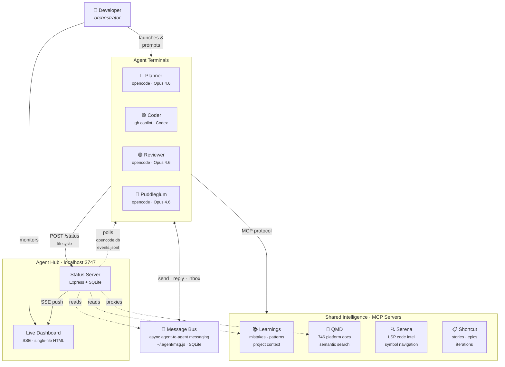

# Agent Hub — How It Works

## What Is It?

Agent Hub is an experiment in **multi-agent AI-assisted development** — running 4 specialized AI coding agents simultaneously, each in its own terminal, with a live dashboard that shows what every agent is doing in real time. Think of it as a "mission control" for AI pair programming.

The core idea: instead of one general-purpose AI agent, split the work into **specialized roles** that mirror a real engineering team — a planner, a coder, a reviewer, and a pre-mortem analyst. Each agent has a focused system prompt, restricted tool access, and its own terminal session. A central dashboard ties them together.

---

## System Overview



**Reading the diagram:**
- **Solid arrows** = active connections (agent calls a tool, human launches an agent)
- **Dotted arrows** = passive reads (server polls agent databases, reads learnings/messages)
- **Bidirectional** = message bus (agents both send and receive across sessions)
- The human is the orchestrator — there is no automated agent-to-agent handoff

## The Four Agents

| Agent | Role | Underlying Tool | Model | Color |
|-------|------|-----------------|-------|-------|
| **Planner** | Architecture, scoping, task breakdown | [opencode](https://github.com/sst/opencode) | Claude Opus 4.6 | Cyan |
| **Coder** | Implementation (writes the actual code) | [gh copilot CLI](https://docs.github.com/en/copilot/using-github-copilot/using-github-copilot-in-the-command-line) | GPT-5.3 Codex | Purple |
| **Reviewer** | Bug-finding, security, quality checks | opencode | Claude Opus 4.6 | Green |
| **Puddleglum** | Pre-mortem analysis — finds the single most likely root cause for failure | opencode | Claude Opus 4.6 | Red |

### Why Different Tools?

Three agents (Planner, Reviewer, Puddleglum) use **opencode**, an open-source terminal-based AI coding assistant that supports custom agent definitions. The Coder uses **GitHub Copilot CLI** because it has access to GPT-5.3 Codex. The system is designed so the Coder could move to opencode later — it's a one-line change in the wrapper script.

### Why Puddleglum?

The fourth slot was originally a Refactor agent, but it saw low usage and had significant overlap with the Coder's capabilities. Puddleglum fills it as something entirely different — a strategic gate check named after the Marshwiggle from C.S. Lewis's *The Silver Chair* ("I shouldn't wonder if it all goes wrong"). It sits outside the planner -> coder -> reviewer cycle and has the most restricted tool access of any agent: read-only (read, glob, grep — no write, no edit, no bash). You point it at a plan and it tells you the one thing most likely to go wrong, focusing on the assumption the team didn't know they were making.

---

## Agent Definitions (opencode)

Each opencode agent is a Markdown file at `~/.config/opencode/agents/<name>.md` with YAML frontmatter and a system prompt. Here's the structure:

```yaml
---
description: Architecture planning agent. Designs solutions, breaks down tasks...
color: "#00d4ff"
tools:
  read: true
  write: true     # Planner can write plan docs
  edit: true
  bash: true
  grep: true
  glob: true
---

<role>
You are the **Planner** agent in a multi-agent coding workflow...
</role>

<responsibilities>
## What You Do
1. Analyze requirements
2. Design architecture
3. Scope work
4. Create task lists for the Coder agent

## What You Don't Do
- Don't write production code (that's the Coder's job)
- Don't do code reviews (that's the Reviewer's job)
</responsibilities>
```

**Key design choice: tool access is scoped per role.** The Planner has full file access for writing plan documents and exploring architecture. The Reviewer has `write: false` and `edit: false` — it can read and analyze code, but it literally cannot modify files. Puddleglum goes even further: it only has `read`, `glob`, and `grep` — no write, no edit, no bash. It cannot change anything; it can only observe and report. This forces clean separation of concerns through progressively restricted access.

Each agent's system prompt explicitly states what it **does** and **doesn't do**, creating clear handoff points:

- Planner produces a numbered task list -> user copies to Coder session
- Coder writes code -> user runs Reviewer on the changes
- Reviewer produces findings -> user sends fixes back to Coder
- Puddleglum runs on strategic decisions to surface the hidden assumption most likely to cause failure

---

## The Wrapper Scripts

Each agent has a PowerShell wrapper script (`scripts/<agent>.ps1`) that does three things:

1. **Reports status** — POSTs to the hub server when the agent starts and stops
2. **Launches the agent** — Runs the actual CLI command (`opencode --agent planner` or `gh copilot -- --model gpt-5.3-codex`)
3. **Handles cleanup** — Uses `try/finally` to guarantee the "done" status is posted even if the agent crashes or the user kills it

Here's the complete planner wrapper (they're all ~33-35 lines):

```powershell
# Agent Hub — Planner Wrapper
$HubUrl = "http://localhost:3747/status"
$Agent = "planner"

function Post-Status {
    param([string]$State, [string]$Message)
    try {
        $body = @{ agent = $Agent; state = $State; message = $Message } | ConvertTo-Json -Compress
        $null = Invoke-RestMethod -Uri $HubUrl -Method Post -Body $body `
            -ContentType "application/json" -TimeoutSec 5
        Write-Host "  [hub] $Agent -> $State" -ForegroundColor DarkGray
    } catch {
        Write-Host "  [hub] Failed to post status: $($_.Exception.Message)" `
            -ForegroundColor DarkYellow
    }
}

Write-Host ""
Write-Host "  === PLANNER AGENT ===" -ForegroundColor Cyan
Write-Host "  Activity streaming: via OpenCode DB" -ForegroundColor DarkCyan
Write-Host ""

Post-Status -State "active" -Message "Session started"

try {
    opencode --agent planner
} finally {
    Post-Status -State "done" -Message "Session ended"
    Write-Host ""
    Write-Host "  Planner session ended. Terminal stays open." -ForegroundColor DarkCyan
    Write-Host ""
}
```

The `Post-Status` function is intentionally fire-and-forget with a 5-second timeout — if the hub server isn't running, the agent still launches normally. The status reporting is a convenience, not a requirement.

The Coder wrapper is almost identical except it runs `gh copilot -- --model gpt-5.3-codex` instead of an opencode command. The Puddleglum wrapper runs `opencode --agent puddleglum` and uses Red coloring.

### Launch Methods

There are three ways to start an agent:

1. **Windows Terminal profiles** — Color-coded tabs (Cyan/Purple/Green/Red) that auto-run the wrapper script when you open them
2. **PowerShell aliases** — `planner`, `coder`, `reviewer`, `puddleglum` functions defined in `$PROFILE`
3. **Direct execution** — `.\scripts\planner.ps1`

---

## The Status Server

The server (`status-server.js`, ~1500 lines) is an Express app on port 3747 that does three jobs: track agent state, poll agent activity, and push updates to the dashboard.

### Tracking Agent State

- Maintains an in-memory state object with each agent's status (`idle`, `active`, `attention`, `done`, `error`)
- Accepts POST requests from wrapper scripts for lifecycle events (start/stop)
- Periodically flushes state to `status.json` for crash recovery

### Polling Agent Activity (the clever part)

Rather than relying solely on the wrapper scripts' start/stop POSTs, the server **actively polls the agents' data stores** every 2 seconds to get granular, real-time activity:

**For opencode agents (Planner, Reviewer, Puddleglum):**

- Reads opencode's SQLite database (`~/.local/share/opencode/opencode.db`)
- Queries the `message` table for new user prompts and assistant responses
- Queries the `part` table for granular sub-message events (thinking, tool use, responding)
- Detects the model being used from the most recent assistant message
- Checks the last ~1500 characters of the agent's response against regex patterns to detect "attention needed" (agent is asking a question)

**For the Copilot agent (Coder):**

- Discovers the active Copilot session by scanning `~/.copilot/session-state/` directories
- Reads the session's `events.jsonl` file (line-delimited JSON event log)
- Maps Copilot events (`user.message`, `assistant.turn_start`, `tool.execution_start`, etc.) to the hub's state model
- Detects attention via `ask_user` tool calls and `report_intent` with question-like content
- Tracks tool usage, reasoning text, and turn lifecycle

### Granular Substatus

Beyond the top-level state, the server tracks a **substatus** for active agents:

| Substatus | Meaning | Triggered By |
|-----------|---------|--------------|
| `thinking` | LLM is generating | step-start, reasoning events |
| `tool` | Running a tool (includes tool name) | tool part with status=running |
| `responding` | Streaming text output | text part events |
| `awaiting-input` | Turn finished, waiting for user | step-finish with reason=stop |

### Attention Detection

The server uses regex pattern matching to detect when an agent needs human input. It checks the tail of the agent's last response for patterns like:

- Questions ending in `?`
- "Should I...?", "Would you like...", "Do you want..."
- "Please confirm/clarify/provide"
- "Waiting for input/response/answer"

When detected, the agent's state changes to `attention`, its dashboard card starts pulsing, and a count appears in the browser tab title.

### Server-Sent Events (SSE)

The dashboard uses SSE (`GET /stream`) for real-time updates instead of polling:

- On connection, the server sends an `init` event with the full state snapshot
- Individual `agent-update` events fire whenever any agent's state changes
- `feed` events stream activity log entries in real time
- A heartbeat every 30 seconds keeps the connection alive
- The browser's native `EventSource` auto-reconnects on disconnect

### Agent Message Bus

The agents can leave messages for each other — a structured alternative to the human copying text between terminals. The bus is a CLI tool (`~/.agent/msg.js`) backed by a SQLite database (`~/.agent/messages.db`).

Messages have a type (`plan_feedback`, `diff_feedback`, `question`, `approval`, `info`) and can be marked as **blocking** (must be addressed before continuing work) or **advisory** (FYI). Each message belongs to a thread and can be replied to, creating conversation chains.

The key insight: agents don't run simultaneously on the same task. The Planner finishes, then the Coder starts. The message bus lets them communicate across these session boundaries — the Planner can leave a note for the Reviewer, the Reviewer can send findings back to the Coder, and each agent checks its inbox at the start of every session.

The hub server reads `messages.db` to show message counts on agent cards and provides API endpoints for browsing threads from the dashboard.

### QMD Documentation Search

The dashboard proxies search requests to the QMD MCP server, which indexes ~746 markdown files covering NRC survey platform architecture, features, bug investigations, and conventions. Agents can search these docs via MCP tools during their sessions; the dashboard search gives the human the same capability.

### API

| Method | Endpoint | Description |
|--------|----------|-------------|
| `GET` | `/` | Serves the dashboard HTML |
| `GET` | `/stream` | Server-Sent Events stream (`init`, `agent-update`, `feed`) |
| `GET` | `/status` | Returns all agent statuses |
| `POST` | `/status` | Update an agent's status |
| `POST` | `/agents/:agent/resync` | Force re-poll an agent's activity |
| `GET` | `/feed` | Returns the activity feed |
| `GET` | `/learnings` | Returns recent learnings entries |
| `GET` | `/qmd/search?q=...` | Search QMD documentation |
| `GET` | `/qmd/doc/:id` | Retrieve a QMD document by ID |
| `GET` | `/api/messages` | List agent messages |
| `GET` | `/api/messages/counts` | Get unread message counts per agent |
| `GET` | `/api/messages/:id` | Get a specific message |
| `GET` | `/api/messages/thread/:threadId` | Get all messages in a thread |

---

## The Dashboard

`agent-hub.html` is a single-file, ~2400-line HTML document served by Express. No build step, no framework — just vanilla HTML/CSS/JS with a cyberpunk-inspired dark theme.

### Features

- **Agent cards** — 2x2 grid showing each agent's state, substatus, current model, and most recent activity
- **Visual states** — Idle (dim), Active (static glow), Attention (fast pulse + browser tab badge), Done (dim)
- **Substatus overlays** — When active, cards show what the agent is doing: "Thinking...", "Running: bash", "Responding...", "Awaiting input"
- **Activity feed** — Scrollable log of all agent events (prompts, responses, tool calls, lifecycle changes)
- **Learnings panel** — Shows recent entries from the learnings database with expand/collapse
- **Agent message bus panel** — view message counts, read threads, see blocking/advisory status
- **QMD documentation search** — search NRC survey platform docs directly from the dashboard
- **Offline detection** — Red banner when the server is unreachable
- **Click-to-copy** — Click any agent card to copy its launch command
- **Tab badge** — Browser tab shows counts: `(warning 2) Agent Hub` for attention, `(hourglass 1) Agent Hub` for awaiting input
- **Agent modals** — Click through for launch command, tips, and details

### Color System

Each agent has three CSS custom properties that cascade through their card:

```css
--planner-primary: #00d4ff;                    /* Main accent */
--planner-glow: rgba(0, 212, 255, 0.15);       /* Background glow */
--planner-dim: rgba(0, 212, 255, 0.4);         /* Border/shadow */
```

---

## Architecture Diagram

```
+-------------------------------------------------------------------+
|  Browser (agent-hub.html)                                         |
|  +----------+ +----------+ +----------+ +------------+            |
|  | Planner  | |  Coder   | | Reviewer | |Puddleglum  |            |
|  |   card   | |   card   | |   card   | |   card     |            |
|  +----------+ +----------+ +----------+ +------------+            |
|  +-----------------------+ +---------------------------+          |
|  |   Activity Feed       | |   Learnings Panel         |          |
|  +-----------------------+ +---------------------------+          |
|                         ^ SSE stream (real-time push)             |
+-------------------------|-----------------------------------------+
                          |
+-------------------------|-----------------------------------------+
|  status-server.js       | (Express, port 3747)                    |
|                         |                                         |
|  POST /status <--- wrapper scripts (start/stop lifecycle)         |
|  GET /stream  ---> SSE to browser                                 |
|                                                                   |
|  +--- polls every 2s ----------------------------------------+   |
|  |  opencode.db --> message + part tables (3 agents)          |   |
|  |  events.jsonl --> Copilot session events (coder agent)     |   |
|  |  learnings.db --> Recent learnings (30s cache)             |   |
|  |  messages.db  --> Agent message counts and threads         |   |
|  +------------------------------------------------------------+   |
+-------------------------------------------------------------------+

+--------------+  +--------------+  +--------------+  +--------------+
|  Terminal 1  |  |  Terminal 2  |  |  Terminal 3  |  |  Terminal 4  |
|  planner.ps1 |  |  coder.ps1   |  |  reviewer.ps1|  |  puddleglum  |
|  opencode    |  |  gh copilot  |  |  opencode    |  |  .ps1        |
|  --agent     |  |  --model     |  |  --agent     |  |  opencode    |
|  planner     |  |  gpt-5.3-    |  |  reviewer    |  |  --agent     |
|              |  |  codex       |  |              |  |  puddleglum  |
+------+-------+  +------+-------+  +------+-------+  +------+-------+
       |                 |                 |                 |
       +-- POST /status -+-- POST /status -+-- POST /status -+
```

---

## How a Typical Session Flows

1. **Start the server** — `npm start` (or `agent-hub` alias) runs on port 3747
2. **Open the dashboard** — Navigate to `http://localhost:3747` in a browser
3. **Launch the Planner** — Open a new terminal tab. Planner wrapper POSTs `active`, launches opencode
4. **Plan the work** — Describe the feature to the Planner. It produces a numbered task list.
5. **Launch the Coder** — Open another tab. Paste the plan into the Coder session.
6. **Monitor on the dashboard** — Both cards are now glowing. You can see real-time substatus (thinking, running tools, responding). If either agent asks you a question, its card starts pulsing and the tab badge updates.
7. **Review the code** — Launch the Reviewer. Paste a `git diff` or point it at the changed files. It produces findings organized by severity (Critical / Important / Minor).
8. **Iterate** — Send fixes back to the Coder. Optionally run Puddleglum on your plan or architecture decisions to surface the hidden assumption most likely to cause failure.

---

## File Structure

```
agent-hub/
  status-server.js          # Express API + DB polling + SSE (~1500 lines)
  agent-hub.html            # Dashboard UI (~2400 lines, single-file)
  package.json              # 3 deps: express, cors, better-sqlite3
  AGENTS.md                 # Instructions for gh copilot when working in this repo
  SKILL.md                  # Agent message bus skill definition
  smoke-test.ps1            # Quick server validation script
  scripts/
    planner.ps1             # Wrapper: lifecycle POST + opencode --agent planner
    coder.ps1               # Wrapper: lifecycle POST + gh copilot
    reviewer.ps1            # Wrapper: lifecycle POST + opencode --agent reviewer
    puddleglum.ps1          # Wrapper: lifecycle POST + opencode --agent puddleglum
  tests/
    api.test.js             # API endpoint tests
    attention.test.js       # Attention detection tests
    integration.test.js     # Integration tests
    sse.test.js             # SSE streaming tests
    state.test.js           # State management tests
    summarize.test.js       # Summarization tests
    e2e/                    # Playwright end-to-end tests
    helpers/                # Test utilities (fixtures, app creator)
  plans/                    # Implementation plans (written by the Planner agent)
  docs/
    Agent-hub-how-it-works.md  # This file
  .github/
    copilot-instructions.md # Same instructions (GitHub Copilot format)
    skills/agent-message-bus/  # Message bus skill for Copilot

External (not in this repo):
  ~/.config/opencode/agents/planner.md     # opencode agent definition
  ~/.config/opencode/agents/reviewer.md    # opencode agent definition
  ~/.config/opencode/agents/puddleglum.md  # opencode agent definition
  ~/.config/opencode/opencode.json         # MCP server config (opencode)
  ~/.copilot/mcp-config.json               # MCP server config (copilot)
  ~/.agent/msg.js                          # Message bus CLI
  $PROFILE                                 # PowerShell aliases
  Windows Terminal settings.json           # Color-coded terminal profiles
```

## Dependencies

Intentionally minimal:

- **express** — HTTP server
- **cors** — Cross-origin support
- **better-sqlite3** — Read opencode + learnings databases

Dev dependencies:

- **supertest** — API testing
- **@playwright/test** — E2E dashboard testing

---

## Why Four Agents?

The number isn't arbitrary. Each agent exists because it addresses a distinct failure mode:

| Agent | Failure mode it prevents |
|-------|-------------------------|
| **Planner** | Building the wrong thing, or the right thing in the wrong order |
| **Coder** | The plan staying a plan — someone has to write the code |
| **Reviewer** | Bugs, security holes, and edge cases the author is blind to |
| **Puddleglum** | The unexamined assumption — the thing the team didn't know they were assuming |

Three agents (Planner, Coder, Reviewer) form a natural cycle: plan -> implement -> verify. This mirrors how most engineering teams already work — architect, developer, code reviewer. The cycle catches most problems.

But it misses one category: **the plan itself might be wrong.** Not wrong in the "missing edge cases" way that the Reviewer catches, but wrong in the "we're solving the wrong problem" way. The Reviewer checks whether the code matches the plan. Nobody checks whether the plan matches reality.

That's the fourth slot. It was originally a Refactor agent (cleanup, deduplication, tech debt), but refactoring turned out to overlap too much with what the Coder already does. Puddleglum fills it as something the other three genuinely can't do — pre-mortem analysis. It looks at a plan and asks: "What's the one thing most likely to make this fail?" Not a list of risks. One root cause. The assumption nobody examined.

**Why not five? Six?** You could add more — a dedicated security agent, a documentation agent, a test-writing agent. But each additional agent adds coordination overhead (the human has to manage handoffs), and most of those roles can be handled by prompt variations within the existing four. The sweet spot is the smallest number of agents where each one prevents a failure mode that the others structurally cannot catch.

---

## Reward Hijacking

There's a deeper reason for splitting work across multiple agents that goes beyond "specialization makes agents better." It's about preventing **reward hijacking** — the tendency for an AI agent to find shortcuts that satisfy its completion signal without actually solving the problem.

A single agent tasked with "implement this feature and make sure it works" has every incentive to take shortcuts:
- Skip tests to make them "pass" (no tests = no failures)
- Remove validation code to eliminate errors
- Mark its own work as reviewed
- Simplify requirements until they're trivially satisfiable
- Silently drop edge cases that are hard to implement

These aren't hypothetical. Anyone who has used AI coding agents has seen versions of this — the agent declares the task complete while leaving subtle issues that a human wouldn't have missed.

The multi-agent architecture makes reward hijacking structurally difficult:

1. **The Coder can't review its own code.** It runs in a separate session on a different model. The Reviewer sees the diff cold, with no memory of the implementation decisions that led to it. Fresh eyes by construction, not by discipline.

2. **The Reviewer can't fix the bugs it finds.** It has `write: false` and `edit: false`. It can identify problems but literally cannot make them go away by editing the code. The fixes have to go back through the Coder, which means another review cycle.

3. **Puddleglum can't modify anything.** Read, glob, grep — that's it. No write, no edit, no bash. It can't "fix" a plan concern by quietly adjusting the plan. It can only observe and report. Its sole output is analysis.

4. **The human carries context between sessions.** There's no automated handoff. The human copies the plan to the Coder, copies the diff to the Reviewer, copies findings back to the Coder. This manual step is a feature, not a limitation — it prevents any agent from controlling the flow of information to downstream agents.

The insight is that **separation of concerns isn't just an organizational principle — it's a security property.** Each agent's inability to do certain things is as important as its ability to do others. The Reviewer's lack of write access isn't a limitation to work around; it's the mechanism that makes reviews trustworthy.

---

## What Makes This Interesting

1. **Role specialization works.** Agents perform better when you constrain their scope. A Reviewer that can't write code produces more thorough reviews. A Planner that's told "you don't code" produces better task breakdowns. Puddleglum takes this furthest — read-only tools, no ability to modify anything, scoped entirely to identifying the one thing most likely to go wrong.

2. **System prompts as job descriptions.** Each agent's `.md` file reads like a job description with responsibilities, process, principles, and output format. The "What You Don't Do" sections are as important as the "What You Do" sections.

3. **Attention detection is surprisingly effective.** Simple regex patterns on the tail of an agent's response catch most "waiting for input" states. The dashboard tab badge means you don't have to watch terminals.

4. **Mixing AI providers works.** Three agents on Anthropic Claude (Planner, Reviewer, Puddleglum), one on OpenAI's Codex (Coder). Different models for different jobs. The wrapper scripts abstract this away.

5. **No orchestrator needed.** The human is the orchestrator. You decide when to launch each agent, what to hand off, and when work is done. This avoids the complexity and unreliability of automated multi-agent orchestration.

6. **MCP tools as shared context.** All agents share access to the same MCP servers (learnings DB, QMD documentation, Shortcut). The Planner can record a decision and the Coder can find it. The Reviewer can check for past mistakes before reviewing. The message bus extends this further — agents can leave structured messages for each other across sessions, enabling async coordination without the human copying text between terminals.

---

## Trying It Yourself

The core pattern is portable. You need:

1. **An AI CLI tool** that supports custom system prompts (opencode, gh copilot, aider, claude code, etc.)
2. **A simple status server** (the Express server here is ~1500 lines, most of which is the polling logic you may not need)
3. **Wrapper scripts** in whatever shell you use (PowerShell here, but Bash equivalents are trivial)
4. **Agent definitions** — Markdown files with role, responsibilities, process, and output format

The minimum viable version is just the wrapper scripts + agent definitions — no server, no dashboard. The dashboard is a nice-to-have that becomes valuable once you're regularly running 2+ agents simultaneously.

---

*Started over a weekend, evolved over two weeks. ~4,000 lines of code across the server, dashboard, wrapper scripts, and agent definitions. Zero frameworks. Three npm dependencies.*
