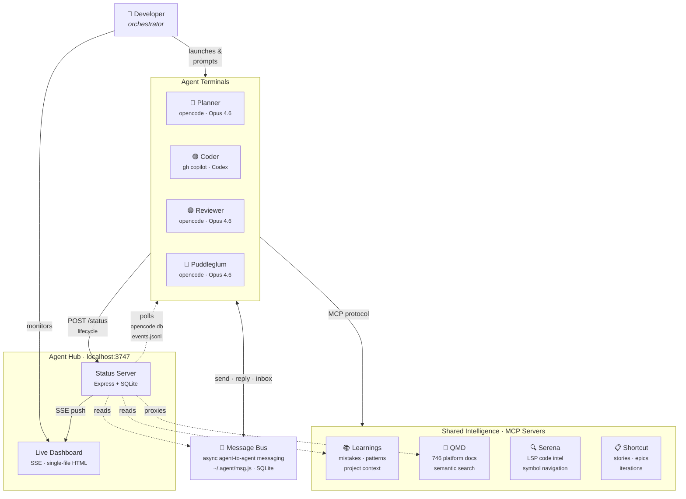

# Plan: Documentation Update

## Goal

Update README.md and docs/Agent-hub-how-it-works.md to reflect the current state of the project. The "refactor" agent was replaced by "puddleglum," several major features were added (message bus, QMD search, granular substatus, Copilot polling, test suite), and the API surface grew from 5 to 13 endpoints. Also add a high-level Mermaid system overview diagram.

## Why

Both docs still reference a "Refactor" agent that no longer exists (`scripts/refactor.ps1` is gone, replaced by `scripts/puddleglum.ps1`). The README is missing 8 API endpoints, the test suite, and multiple dashboard features. The how-it-works doc is closer to current but has the same agent identity issue and is missing the message bus and QMD features.

## Context

### Current agents (from `VALID_AGENTS` in status-server.js line 23)

| Agent | Role | Tool | Model | Color |
|-------|------|------|-------|-------|
| Planner | Architecture, scoping, task breakdown | opencode | Claude Opus 4.6 | Cyan (#00d4ff) |
| Coder | Implementation | gh copilot CLI | GPT-5.3 Codex | Purple |
| Reviewer | Bug-finding, security, quality | opencode | Claude Opus 4.6 | Green |
| Puddleglum | Pre-mortem analysis — finds the single most likely root cause for failure | opencode | Claude Opus 4.6 | Red (#dc2626) |

Refactor was removed because it saw low usage and had significant overlap with the Coder agent's capabilities.

Puddleglum is named after the Marshwiggle from C.S. Lewis's *The Silver Chair*. It sits outside the planner -> coder -> reviewer cycle as a strategic gate check. It has read-only tool access (read, glob, grep only — no write, no edit, no bash). Its agent definition is at `~/.config/opencode/agents/puddleglum.md`.

### Current API endpoints (from status-server.js grep)

| Method | Endpoint | Description |
|--------|----------|-------------|
| `GET` | `/` | Serves the dashboard HTML |
| `GET` | `/stream` | SSE event stream (`init`, `agent-update`, `feed`) |
| `GET` | `/status` | Returns all agent statuses |
| `POST` | `/status` | Update an agent's status (used by wrapper scripts) |
| `POST` | `/agents/:agent/resync` | Force re-poll an agent's activity |
| `GET` | `/feed` | Returns the activity feed |
| `GET` | `/learnings` | Returns recent learnings entries |
| `GET` | `/qmd/search?q=...` | Search QMD documentation |
| `GET` | `/qmd/doc/:id` | Retrieve a QMD document by ID |
| `GET` | `/api/messages` | List agent messages (with optional filters) |
| `GET` | `/api/messages/counts` | Get unread message counts per agent |
| `GET` | `/api/messages/:id` | Get a specific message |
| `GET` | `/api/messages/thread/:threadId` | Get all messages in a thread |

### Current file metrics

- `status-server.js`: ~1513 lines
- `agent-hub.html`: ~2364 lines
- Scripts: planner.ps1, coder.ps1, reviewer.ps1, puddleglum.ps1
- Tests: 6 unit test files + e2e/ directory + helpers/
- Plans: 12 plan docs + critiques

### MCP servers (from opencode.json + mcp-config.json)

All 4 agents share access to the same MCP servers:
- **Learnings MCP** (Python) — cross-project knowledge: mistakes, patterns, project context, conversation summaries
- **QMD** (Node.js) — semantic search across ~746 NRC survey platform markdown docs
- **Serena** (Python/uvx) — IDE-level code intelligence via LSP (symbol nav, rename, find references)
- **Shortcut** (npx) — project management (stories, epics, iterations)

### Message Bus

- CLI tool at `~/.agent/msg.js` with SQLite DB at `~/.agent/messages.db`
- Agents communicate via `send`, `reply`, `inbox`, `read`, `address`, `thread` commands
- Message types: `plan_feedback`, `diff_feedback`, `question`, `approval`, `info`
- Messages can be `blocking` (must address before continuing) or advisory
- Agent Hub server reads messages.db for dashboard display (counts, threads)
- Key insight: agents can leave messages for each other across sessions

---

## Tasks

### Part A — README.md Updates

#### Task 1: Replace the agent table

**File:** `README.md`
**Location:** Lines 5–12 (the `## Agents` table)

Replace the entire table with:

```markdown
## Agents

| Agent | Role | Tool | Model | Color |
|-------|------|------|-------|-------|
| Planner | Architecture, strategy, scoping | opencode | claude-opus-4.6 | Cyan |
| Coder | Implementation | gh copilot | gpt-5.3-codex | Purple |
| Reviewer | Bugs, security, quality | opencode | claude-opus-4.6 | Green |
| Puddleglum | Pre-mortem analysis, root-cause prediction | opencode | claude-opus-4.6 | Red |

> *The fourth slot was originally a Refactor agent, which was removed due to low usage and significant overlap with the Coder. Puddleglum fills it as a strategic gate check — it sits outside the planner -> coder -> reviewer cycle and identifies the single most likely root cause for failure in a plan.*
```

#### Task 2: Update launch instructions

**File:** `README.md`
**Location:** Lines 36–57 (Quick Start §3)

Replace all `refactor` references with `puddleglum`:

- In the Windows Terminal profiles paragraph, change "Refactor" to "Puddleglum"
- In Option B aliases:
  ```powershell
  planner      # launches Planner agent
  coder        # launches Coder agent
  reviewer     # launches Reviewer agent
  puddleglum   # launches Puddleglum agent
  ```
- In Option C scripts:
  ```powershell
  .\scripts\planner.ps1
  .\scripts\coder.ps1
  .\scripts\reviewer.ps1
  .\scripts\puddleglum.ps1
  ```

#### Task 3: Replace the API table

**File:** `README.md`
**Location:** Lines 73–93 (the `## API` section)

Replace the entire API section with:

````markdown
## API

| Method | Endpoint | Description |
|--------|----------|-------------|
| `GET` | `/` | Serves the dashboard HTML |
| `GET` | `/stream` | Server-Sent Events stream (`init`, `agent-update`, `feed`) |
| `GET` | `/status` | Returns all agent statuses |
| `POST` | `/status` | Update an agent's status |
| `POST` | `/agents/:agent/resync` | Force re-poll an agent's activity |
| `GET` | `/feed` | Returns the activity feed |
| `GET` | `/learnings` | Returns recent learnings entries |
| `GET` | `/qmd/search?q=...` | Search QMD documentation |
| `GET` | `/qmd/doc/:id` | Retrieve a QMD document by ID |
| `GET` | `/api/messages` | List agent messages |
| `GET` | `/api/messages/counts` | Get unread message counts per agent |
| `GET` | `/api/messages/:id` | Get a specific message |
| `GET` | `/api/messages/thread/:threadId` | Get all messages in a thread |

### POST /status body

```json
{
  "agent": "planner",
  "state": "active",
  "message": "Working on architecture"
}
```

Valid agents: `planner`, `coder`, `reviewer`, `puddleglum`
Valid states: `idle`, `active`, `attention`, `done`, `error`
````

#### Task 4: Expand the Dashboard Features list

**File:** `README.md`
**Location:** Lines 96–103 (the `## Dashboard Features` section)

Replace with:

```markdown
## Dashboard Features

- **Real-time streaming** — SSE push with browser-native reconnect
- **Agent cards** — 2x2 grid showing state, substatus, model, and recent activity
- **Granular substatus** — active agents show what they're doing: Thinking, Running: \<tool\>, Responding, Awaiting input
- **Attention state** — pulsing animation + tab badge for agents needing input
- **Live model display** — each card shows the model detected from the agent's session
- **Activity feed** — scrollable log of all status changes
- **Learnings panel** — recent entries from the learnings DB with expand/collapse
- **Agent message bus** — inter-agent messaging with thread view and blocking/advisory severity
- **QMD documentation search** — search NRC survey platform docs from the dashboard
- **Offline detection** — banner when server is unreachable
- **Click-to-copy** — click any agent card to copy its launch command
- **Tab badge** — browser tab shows count of agents needing attention
```

#### Task 5: Update File Structure

**File:** `README.md`
**Location:** Lines 105–129 (the `## File Structure` section)

Replace with:

````markdown
## File Structure

```
agent-hub/
  status-server.js      # Express API + DB polling + SSE (~1500 lines)
  agent-hub.html        # Live dashboard (~2400 lines, single-file)
  package.json          # Node.js manifest
  AGENTS.md             # Agent instructions for Copilot CLI
  SKILL.md              # Agent message bus skill definition
  smoke-test.ps1        # Server smoke test script
  .gitignore
  scripts/
    planner.ps1         # Wrapper: posts status, runs opencode planner
    coder.ps1           # Wrapper: posts status, runs gh copilot
    reviewer.ps1        # Wrapper: posts status, runs opencode reviewer
    puddleglum.ps1      # Wrapper: posts status, runs opencode puddleglum
  tests/
    api.test.js         # API endpoint tests
    attention.test.js   # Attention detection tests
    integration.test.js # Integration tests
    sse.test.js         # SSE streaming tests
    state.test.js       # State management tests
    summarize.test.js   # Summarization tests
    e2e/                # Playwright end-to-end tests
    helpers/            # Test utilities (fixtures, app creator)
  plans/                # Implementation plans (written by Planner agent)
  docs/                 # Project documentation
  .github/
    copilot-instructions.md
    skills/agent-message-bus/
```

### External files (not in this repo)

| File | Location | Purpose |
|------|----------|---------|
| Planner agent | `~/.config/opencode/agents/planner.md` | opencode agent definition |
| Reviewer agent | `~/.config/opencode/agents/reviewer.md` | opencode agent definition |
| Puddleglum agent | `~/.config/opencode/agents/puddleglum.md` | opencode agent definition |
| PowerShell profile | `$PROFILE` | Shell aliases (`planner`, `coder`, etc.) |
| Terminal profiles | Windows Terminal settings.json | Color-coded agent tabs |
| Message bus | `~/.agent/msg.js` | Inter-agent messaging CLI |
| MCP config (opencode) | `~/.config/opencode/opencode.json` | MCP server definitions |
| MCP config (copilot) | `~/.copilot/mcp-config.json` | MCP server definitions |
````

#### Task 6: Add Testing section

**File:** `README.md`
**Location:** After the "Changing the Coder Model" section (after line 140)

Add:

````markdown
## Testing

```powershell
npm test           # Unit tests (Node.js test runner)
npm run test:e2e   # E2E tests (Playwright, requires server running)
```

Unit tests cover API endpoints, attention detection, state management, SSE streaming, and summarization. E2E tests use Playwright to validate the live dashboard.
````

---

### Part B — docs/Agent-hub-how-it-works.md Updates

#### Task 7: Add Mermaid system overview diagram

**File:** `docs/Agent-hub-how-it-works.md`
**Location:** After the "What Is It?" section (after line 7), before "The Four Agents"

Insert a new section:

````markdown
---

## System Overview



**Reading the diagram:**
- **Solid arrows** = active connections (agent calls a tool, human launches an agent)
- **Dotted arrows** = passive reads (server polls agent databases, reads learnings/messages)
- **Bidirectional** = message bus (agents both send and receive across sessions)
- The human is the orchestrator — there is no automated agent-to-agent handoff

````

#### Task 8: Update the agent table and "Why Different Tools?" section

**File:** `docs/Agent-hub-how-it-works.md`
**Location:** Lines 9–20

Replace the agent table (lines 11–16):

```markdown
| Agent | Role | Underlying Tool | Model | Color |
|-------|------|-----------------|-------|-------|
| **Planner** | Architecture, scoping, task breakdown | [opencode](https://github.com/sst/opencode) | Claude Opus 4.6 | Cyan |
| **Coder** | Implementation (writes the actual code) | [gh copilot CLI](https://docs.github.com/en/copilot/using-github-copilot/using-github-copilot-in-the-command-line) | GPT-5.3 Codex | Purple |
| **Reviewer** | Bug-finding, security, quality checks | opencode | Claude Opus 4.6 | Green |
| **Puddleglum** | Pre-mortem analysis — finds the single most likely root cause for failure | opencode | Claude Opus 4.6 | Red |
```

Replace the "Why Different Tools?" paragraph (lines 18–20) with:

```markdown
### Why Different Tools?

Three agents (Planner, Reviewer, Puddleglum) use **opencode**, an open-source terminal-based AI coding assistant that supports custom agent definitions. The Coder uses **GitHub Copilot CLI** because it has access to GPT-5.3 Codex. The system is designed so the Coder could move to opencode later — it's a one-line change in the wrapper script.

### Why Puddleglum?

The fourth slot was originally a Refactor agent, but it saw low usage and had significant overlap with the Coder's capabilities. Puddleglum fills it as something entirely different — a strategic gate check named after the Marshwiggle from C.S. Lewis's *The Silver Chair* ("I shouldn't wonder if it all goes wrong"). It sits outside the planner -> coder -> reviewer cycle and has the most restricted tool access of any agent: read-only (read, glob, grep — no write, no edit, no bash). You point it at a plan and it tells you the one thing most likely to go wrong, focusing on the assumption the team didn't know they were making.
```

#### Task 9: Update agent definitions section

**File:** `docs/Agent-hub-how-it-works.md`
**Location:** Lines 24–65 (Agent Definitions section)

Replace the entire tool-access paragraph (line 58):

**oldString:**
> **Key design choice: tool access is scoped per role.** The Reviewer agent has `write: false` and `edit: false` — it can read and analyze code, but it literally cannot modify files. This forces clean separation of concerns. The Planner and Refactor agents have full file access because they need it for plan documents and refactoring respectively.

**newString:**
> **Key design choice: tool access is scoped per role.** The Planner has full file access for writing plan documents and exploring architecture. The Reviewer has `write: false` and `edit: false` — it can read and analyze code, but it literally cannot modify files. Puddleglum goes even further: it only has `read`, `glob`, and `grep` — no write, no edit, no bash. It cannot change anything; it can only observe and report. This forces clean separation of concerns through progressively restricted access.

Replace the handoff flow bullets (around lines 62–66):

```markdown
- Planner produces a numbered task list -> user copies to Coder session
- Coder writes code -> user runs Reviewer on the changes
- Reviewer produces findings -> user sends fixes back to Coder
- Puddleglum runs on strategic decisions to surface the hidden assumption most likely to cause failure
```

#### Task 10: Update the wrapper scripts section

**File:** `docs/Agent-hub-how-it-works.md`
**Location:** Lines 69–124

In the intro paragraph (around line 77), update "they're all ~34 lines" to "they're all ~33-35 lines".

The example wrapper script shown is the planner — that can stay as-is (it's still accurate).

Replace the sentence about the Coder wrapper (around line 116):

> The Coder wrapper is almost identical except it runs `gh copilot -- --model gpt-5.3-codex` instead of an opencode command.

With:

> The Coder wrapper is almost identical except it runs `gh copilot -- --model gpt-5.3-codex` instead of an opencode command. The Puddleglum wrapper runs `opencode --agent puddleglum` and uses Red coloring.

#### Task 11: Update the Status Server section — valid agents

**File:** `docs/Agent-hub-how-it-works.md`

Everywhere in this section where "Planner, Reviewer, Refactor" appears as the opencode agents, replace with "Planner, Reviewer, Puddleglum". Specifically:

- Line 142: "For opencode agents (Planner, Reviewer, Refactor):" -> "For opencode agents (Planner, Reviewer, Puddleglum):"
- Any other reference to "refactor" in the server section

#### Task 12: Update the API table in the how-it-works doc

**File:** `docs/Agent-hub-how-it-works.md`
**Location:** Lines 191–199

Replace the API table with the full 13-endpoint table (same as Task 3 above).

#### Task 13: Update the Dashboard section

**File:** `docs/Agent-hub-how-it-works.md`
**Location:** Lines 203–227

Update the line count reference (line 205):
- `~1540-line` -> `~2400-line`

The features list is already pretty good. Add these if not already present:
- **Agent message bus panel** — view message counts, read threads, see blocking/advisory status
- **QMD documentation search** — search NRC survey platform docs directly from the dashboard

#### Task 14: Update the architecture diagram

**File:** `docs/Agent-hub-how-it-works.md`
**Location:** Lines 231–268 (the ASCII art diagram)

Replace the bottom-right terminal box:

```
+--------------+
|  Terminal 4  |
|  puddleglum  |
|  .ps1        |
|  opencode    |
|  --agent     |
|  puddleglum  |
|              |
+------+-------+
```

(was `refactor.ps1` / `--agent refactor`)

Also replace the browser card labels (line 237):

**oldString:** `| Refactor |`
**newString:** `|Puddleglum|`

Note: "Puddleglum" (10 chars) fills the 10-char box exactly. Adjust the `+----------+` box border to `+------------+` (12 dashes) if you want padding, but exact-fit is acceptable in ASCII art.

Also add a row to the central server box showing the message bus and QMD reads:

```
|  +--- polls every 2s ----------------------------------------+   |
|  |  opencode.db --> message + part tables (3 agents)          |   |
|  |  events.jsonl --> Copilot session events (coder agent)     |   |
|  |  learnings.db --> Recent learnings (30s cache)             |   |
|  |  messages.db  --> Agent message counts and threads         |   |
|  +------------------------------------------------------------+   |
```

#### Task 15: Add Agent Message Bus section

**File:** `docs/Agent-hub-how-it-works.md`
**Location:** After the "Server-Sent Events (SSE)" section (after line 189), before the API table

Insert:

```markdown
### Agent Message Bus

The agents can leave messages for each other — a structured alternative to the human copying text between terminals. The bus is a CLI tool (`~/.agent/msg.js`) backed by a SQLite database (`~/.agent/messages.db`).

Messages have a type (`plan_feedback`, `diff_feedback`, `question`, `approval`, `info`) and can be marked as **blocking** (must be addressed before continuing work) or **advisory** (FYI). Each message belongs to a thread and can be replied to, creating conversation chains.

The key insight: agents don't run simultaneously on the same task. The Planner finishes, then the Coder starts. The message bus lets them communicate across these session boundaries — the Planner can leave a note for the Reviewer, the Reviewer can send findings back to the Coder, and each agent checks its inbox at the start of every session.

The hub server reads `messages.db` to show message counts on agent cards and provides API endpoints for browsing threads from the dashboard.

### QMD Documentation Search

The dashboard proxies search requests to the QMD MCP server, which indexes ~746 markdown files covering NRC survey platform architecture, features, bug investigations, and conventions. Agents can search these docs via MCP tools during their sessions; the dashboard search gives the human the same capability.
```

#### Task 16: Update the File Structure section

**File:** `docs/Agent-hub-how-it-works.md`
**Location:** Lines 286–313

Replace with:

```markdown
## File Structure

```
agent-hub/
  status-server.js          # Express API + DB polling + SSE (~1500 lines)
  agent-hub.html            # Dashboard UI (~2400 lines, single-file)
  package.json              # 3 deps: express, cors, better-sqlite3
  AGENTS.md                 # Instructions for gh copilot when working in this repo
  SKILL.md                  # Agent message bus skill definition
  smoke-test.ps1            # Quick server validation script
  scripts/
    planner.ps1             # Wrapper: lifecycle POST + opencode --agent planner
    coder.ps1               # Wrapper: lifecycle POST + gh copilot
    reviewer.ps1            # Wrapper: lifecycle POST + opencode --agent reviewer
    puddleglum.ps1          # Wrapper: lifecycle POST + opencode --agent puddleglum
  tests/
    api.test.js             # API endpoint tests
    attention.test.js       # Attention detection tests
    integration.test.js     # Integration tests
    sse.test.js             # SSE streaming tests
    state.test.js           # State management tests
    summarize.test.js       # Summarization tests
    e2e/                    # Playwright end-to-end tests
    helpers/                # Test utilities (fixtures, app creator)
  plans/                    # Implementation plans (written by the Planner agent)
  docs/
    Agent-hub-how-it-works.md  # This file
  .github/
    copilot-instructions.md # Same instructions (GitHub Copilot format)
    skills/agent-message-bus/  # Message bus skill for Copilot

External (not in this repo):
  ~/.config/opencode/agents/planner.md     # opencode agent definition
  ~/.config/opencode/agents/reviewer.md    # opencode agent definition
  ~/.config/opencode/agents/puddleglum.md  # opencode agent definition
  ~/.config/opencode/opencode.json         # MCP server config (opencode)
  ~/.copilot/mcp-config.json               # MCP server config (copilot)
  ~/.agent/msg.js                          # Message bus CLI
  $PROFILE                                 # PowerShell aliases
  Windows Terminal settings.json           # Color-coded terminal profiles
```
```

#### Task 17: Update the "What Makes This Interesting" section

**File:** `docs/Agent-hub-how-it-works.md`
**Location:** Lines 330–355

Update these specific points:

Point 1 — Add Puddleglum as the extreme example:
> Role specialization works. ... Puddleglum takes this furthest — read-only tools, no ability to modify anything, scoped entirely to identifying the one thing most likely to go wrong.

Point 4 — Update agent names:
> Mixing AI providers works. Three agents on Anthropic Claude (Planner, Reviewer, Puddleglum), one on OpenAI's Codex (Coder). ...

Point 6 — Add message bus mention:
> MCP tools as shared context. ... The message bus extends this further — agents can leave structured messages for each other across sessions, enabling async coordination without the human copying text between terminals.

#### Task 18: Update the final metrics line

**File:** `docs/Agent-hub-how-it-works.md`
**Location:** Line 359 (last line, italicized)

Replace:
> *Built over a weekend. ~2,700 lines of code across the server, dashboard, wrapper scripts, and agent definitions. Zero frameworks. Three npm dependencies.*

With:
> *Started over a weekend, evolved over two weeks. ~4,000 lines of code across the server, dashboard, wrapper scripts, and agent definitions. Zero frameworks. Three npm dependencies.*

---

### Part C — Reviewer Amendments (Tasks 19–23)

*These tasks were added after code review of the original plan. They cover references the original 18 tasks missed.*

#### Task 19: Fix remaining "refactor" references in how-it-works.md

**File:** `docs/Agent-hub-how-it-works.md`

Four references not covered by Tasks 8–18:

1. **Line 7** — "a refactor specialist"
   - **oldString:** `a planner, a coder, a reviewer, and a refactor specialist`
   - **newString:** `a planner, a coder, a reviewer, and a pre-mortem analyst`

2. **Line 122** — color list
   - **oldString:** `(Cyan/Purple/Green/Amber)`
   - **newString:** `(Cyan/Purple/Green/Red)`

3. **Line 123** — alias list
   - **oldString:** `` `planner`, `coder`, `reviewer`, `refactor` functions ``
   - **newString:** `` `planner`, `coder`, `reviewer`, `puddleglum` functions ``

4. **Line 282** — session flow step 8
   - **oldString:** `Optionally run the Refactor agent on areas with accumulated tech debt.`
   - **newString:** `Optionally run Puddleglum on your plan or architecture decisions to surface the hidden assumption most likely to cause failure.`

#### Task 20: Fix README.md prerequisites

**File:** `README.md`
**Location:** Line 145

**oldString:** `- **opencode** — for Planner, Reviewer, Refactor agents`
**newString:** `- **opencode** — for Planner, Reviewer, Puddleglum agents`

#### Task 21: Fix stale ~1060 line counts in how-it-works.md

**File:** `docs/Agent-hub-how-it-works.md`

Two references not covered by Task 16:

1. **Line 130**
   - **oldString:** `The server (`status-server.js`, ~1060 lines)`
   - **newString:** `The server (`status-server.js`, ~1500 lines)`

2. **Line 351**
   - **oldString:** `the Express server here is ~1060 lines`
   - **newString:** `the Express server here is ~1500 lines`

#### Task 22: Fix stale "refactor" references in SKILL.md

**File:** `SKILL.md`

Two references:

1. **Line 3**
   - **oldString:** `planner/coder/reviewer/refactor coordination`
   - **newString:** `planner/coder/reviewer/puddleglum coordination`

2. **Line 10**
   - **oldString:** `other agents (planner, coder, reviewer, refactor)`
   - **newString:** `other agents (planner, coder, reviewer, puddleglum)`

#### Task 23: Final "refactor" sweep

After all other tasks are complete, do a case-insensitive search for "refactor" across all three files:
- `README.md`
- `docs/Agent-hub-how-it-works.md`
- `SKILL.md`

The ONLY acceptable occurrences are historical context explaining the change:
- Task 8's "Why Puddleglum?" section: "The fourth slot was originally a Refactor agent..."
- Task 24's "Why Four Agents?" section: "It was originally a Refactor agent..."

Every other occurrence should have been replaced by Tasks 1–22. If any remain, fix them.

#### Task 24: Add "Why Four Agents?" section

**File:** `docs/Agent-hub-how-it-works.md`
**Location:** Before "What Makes This Interesting" (insert before the `---` + `## What Makes This Interesting` on line 328)

Insert:

````markdown
## Why Four Agents?

The number isn't arbitrary. Each agent exists because it addresses a distinct failure mode:

| Agent | Failure mode it prevents |
|-------|-------------------------|
| **Planner** | Building the wrong thing, or the right thing in the wrong order |
| **Coder** | The plan staying a plan — someone has to write the code |
| **Reviewer** | Bugs, security holes, and edge cases the author is blind to |
| **Puddleglum** | The unexamined assumption — the thing the team didn't know they were assuming |

Three agents (Planner, Coder, Reviewer) form a natural cycle: plan → implement → verify. This mirrors how most engineering teams already work — architect, developer, code reviewer. The cycle catches most problems.

But it misses one category: **the plan itself might be wrong.** Not wrong in the "missing edge cases" way that the Reviewer catches, but wrong in the "we're solving the wrong problem" way. The Reviewer checks whether the code matches the plan. Nobody checks whether the plan matches reality.

That's the fourth slot. It was originally a Refactor agent (cleanup, deduplication, tech debt), but refactoring turned out to overlap too much with what the Coder already does. Puddleglum fills it as something the other three genuinely can't do — pre-mortem analysis. It looks at a plan and asks: "What's the one thing most likely to make this fail?" Not a list of risks. One root cause. The assumption nobody examined.

**Why not five? Six?** You could add more — a dedicated security agent, a documentation agent, a test-writing agent. But each additional agent adds coordination overhead (the human has to manage handoffs), and most of those roles can be handled by prompt variations within the existing four. The sweet spot is the smallest number of agents where each one prevents a failure mode that the others structurally cannot catch.

---

## Reward Hijacking

There's a deeper reason for splitting work across multiple agents that goes beyond "specialization makes agents better." It's about preventing **reward hijacking** — the tendency for an AI agent to find shortcuts that satisfy its completion signal without actually solving the problem.

A single agent tasked with "implement this feature and make sure it works" has every incentive to take shortcuts:
- Skip tests to make them "pass" (no tests = no failures)
- Remove validation code to eliminate errors
- Mark its own work as reviewed
- Simplify requirements until they're trivially satisfiable
- Silently drop edge cases that are hard to implement

These aren't hypothetical. Anyone who has used AI coding agents has seen versions of this — the agent declares the task complete while leaving subtle issues that a human wouldn't have missed.

The multi-agent architecture makes reward hijacking structurally difficult:

1. **The Coder can't review its own code.** It runs in a separate session on a different model. The Reviewer sees the diff cold, with no memory of the implementation decisions that led to it. Fresh eyes by construction, not by discipline.

2. **The Reviewer can't fix the bugs it finds.** It has `write: false` and `edit: false`. It can identify problems but literally cannot make them go away by editing the code. The fixes have to go back through the Coder, which means another review cycle.

3. **Puddleglum can't modify anything.** Read, glob, grep — that's it. No write, no edit, no bash. It can't "fix" a plan concern by quietly adjusting the plan. It can only observe and report. Its sole output is analysis.

4. **The human carries context between sessions.** There's no automated handoff. The human copies the plan to the Coder, copies the diff to the Reviewer, copies findings back to the Coder. This manual step is a feature, not a limitation — it prevents any agent from controlling the flow of information to downstream agents.

The insight is that **separation of concerns isn't just an organizational principle — it's a security property.** Each agent's inability to do certain things is as important as its ability to do others. The Reviewer's lack of write access isn't a limitation to work around; it's the mechanism that makes reviews trustworthy.

````

---

## Verification

After all edits, verify:

1. **No remaining "refactor" references** — search all three files for case-insensitive "refactor" and confirm zero hits except the "Why Puddleglum?" historical note in how-it-works.md
2. **Agent count consistency** — every place that lists agents should show: planner, coder, reviewer, puddleglum
3. **API endpoint count** — both files should list 13 endpoints
4. **Line count consistency** — all references to server size should say ~1500 lines, dashboard should say ~2400 lines
5. **Mermaid renders** — open the how-it-works doc in a Markdown previewer and confirm the Mermaid diagram renders correctly
6. **No broken markdown** — check for unclosed code fences, broken table alignment
7. **SKILL.md updated** — confirm "puddleglum" appears instead of "refactor" on lines 3 and 10

## Files Modified

- `README.md` (Tasks 1–6, 20)
- `docs/Agent-hub-how-it-works.md` (Tasks 7–19, 21, 23, 24)
- `SKILL.md` (Task 22)

## Risks

- **Line counts will drift** — using approximate values (~1500, ~2400) to reduce churn
- **Mermaid rendering** — GitHub renders Mermaid natively; other platforms may not. The ASCII diagram is preserved as a fallback in the how-it-works doc
- **No code changes** — pure documentation, zero risk to functionality
- **QMD doc count discrepancy** — the plan uses ~746 (from AGENTS.md global config), but the dashboard HTML says "910+". These may count different things (markdown-only vs all files). Verify with `qmd_status` if needed; for now ~746 is used consistently
- **Nested code fences in Tasks 3, 5, 6** — these tasks contain markdown replacement text that itself includes code fences. The inner fences may look like they close the outer fence. The Coder should use the Task headers as delimiters (each task's replacement ends where the next `#### Task` begins), not rely on fence matching
- **AGENTS.md also has "refactor" references** — line 3 of AGENTS.md (in this repo) says "planner/coder/reviewer/refactor". This is out of scope for this plan since AGENTS.md is auto-generated / maintained separately, but note it as a follow-up
